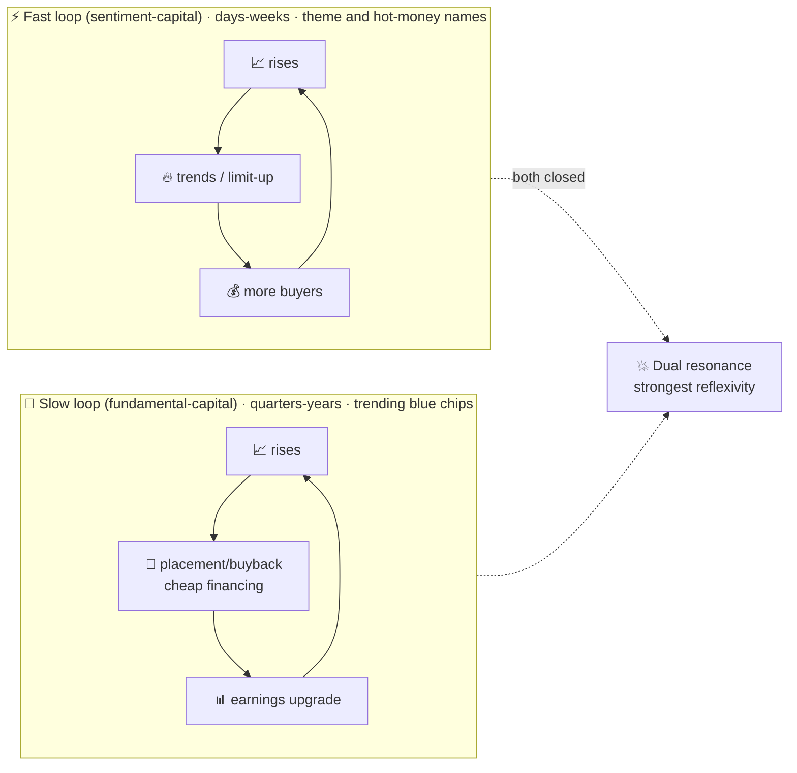

# 🔄 Soros Reflexivity Detector

[简体中文](README.md) | **English**

> **Reflexivity = the self-reinforcing loop where rising begets rising and falling begets falling.**
> This tool quantifies the *strength and stage* of "price making its own trend", answering
> "can I ride it / which turn of the loop is it on / when should I be out"
> — **it does not predict tops or bottoms and is not investment advice.**

> Project status: QUANTSKILLS **Community Project** — not reviewed, certified or endorsed by QuantSkills. Task ID `#48`.

<p align="center">
  
  
  
  
  
  
  
  
</p>

---

## 📖 What this is

In real markets the efficient-market hypothesis is largely broken and chasing rallies is the norm. That is exactly what
Soros's **theory of reflexivity** describes: participants' perceptions move prices, and prices move perceptions back,
forming a self-reinforcing loop.

This skill **quantifies** that loop and answers the three questions that matter in trading:

1. Is this move **self-reinforcing** (can you ride it)?
2. Which **turn of the loop** is it on (position discipline)?
3. Is **fuel** (fresh money) still flowing, and is the **tank leaking** (pledge / lockup release / block trades)?

**Explicitly does NOT**: predict tops or bottoms, judge "value", or assume market efficiency.

---

## 🔁 The dual-loop model



`loop_type ∈ {fast, slow, dual, none}` selects the window parameters — **the fast loop is measured in days, the slow loop
in quarters** — same state machine, different ruler.

| Loop | Circuit | Horizon | Arena | Reading |
|---|---|---|---|---|
| **Fast** (sentiment-capital) | up → trending → more buyers → up | days–weeks | theme / hot-money stocks (**no fundamentals needed**) | `FastLoop` (price × attention × money resonance) |
| **Slow** (fundamental-capital) | up → placement/buyback improves the books → earnings upgrade → up | quarters–years | trending blue chips, industry uptrends | `CogF × ParF` (both functions active) |
| **Dual resonance** | both closed simultaneously | — | strongest reflexivity | both high |

---

## 🎬 Stage machine (six stages + the test, with consecutive-day confirmation)

```mermaid
stateDiagram-v2
    [*] --> S0

    S0: 🔘 S0 neutral - no self-reinforcing loop
    S1: 🌱 S1 early - smart money in, crowd unaware
    S2: 🚀 S2 crowd chasing - fuelled and accelerating
    S2T: 🥊 S2T under test - shakeout; surviving adds conviction
    S3: 🔥 S3 euphoria to twilight - "good news, no rally" is the first alarm
    S4: 💥 S4 rupture - drawdown + volume divergence + fuel retreat
    S5: ❄️ S5 negative reflexivity - falling begets selling

    S0 --> S1: weak trend + upgrade + same direction
    S1 --> S2: clear trend + acceleration + fuel
    S2 --> S2T: 5-12% pullback, fundamentals intact
    S2T --> S2: new high, conviction +1
    S2T --> S0: trend broken, test failed
    S2 --> S3: extreme percentile + fundamentals lag
    S3 --> S4: drawdown >=15% + divergence or fuel retreat
    S2 --> S4: same
    S4 --> S5: downtrend established
    S3 --> S5: outright collapse
    S5 --> S0: washed out, stabilising
```



| Stage | In plain terms | Position advice |
|---|---|---|
| `S0` neutral | no self-reinforcing loop | `observe` |
| `S1` early | smart money entering, trend not yet recognised | `observe` |
| `S2` accelerating | crowd chasing, fuel ample (includes the **test**: surviving a shakeout adds conviction) | **`add`** |
| `S3` euphoria → twilight | extreme percentile, fundamentals cannot keep up; **"good news, no rally" (CogF decay) is the first twilight signal** | **`reduce`** |
| `S4` rupture | ≥15% drawdown from the high + **volume top divergence** / fuel retreat → the loop is broken | `exit` |
| `S5` negative reflexivity | falling begets selling (incl. pledge spiral: fall → forced liquidation → fall) | `avoid` |

> **Rupture is only ever fallen into from inside the loop**: a name that never reached S1/S2/S3 is merely declining,
> however deep the drawdown, and will not be mislabelled S4.
> Volume top divergence means "**price makes new highs while volume does not follow**" — the bidders are leaving.

---

## 🧮 Core readings

| Reading | Academic | Plain |
|---|---|---|
| `P` | price trend strength (slope ÷ volatility) | how steep and how steady the rise is |
| `Sync` | co-movement of price trend and earnings revision | is the loop closed |
| `GAP` | price percentile − fundamental percentile | how far price has run ahead of fundamentals |
| `CogF` | cognitive-function activity | market excitement about good news; **"good news, no rally" = excitement exhausted** |
| `ParF` | participating-function activity | is the price "creating" fundamentals (placements at highs, buybacks fattening EPS) |
| `FB_long` | positive-feedback fuel | how much fresh money is still arriving (margin / hot money / turnover / buybacks) |
| `FB_neg` | negative-feedback fragility | leaks in the tank: heavy pledging, large lockup releases, discounted block trades |
| `VolDiv` | volume top divergence | price still pushing up but visibly fewer buyers — hollow |
| `conviction` | conviction count | how many shakeouts it survived; **the more it survives, the more dangerous the belief** |

Every output carries a `plain_text` verdict in ordinary language, quotable directly to the user.

---

## 🚀 Quick start

```bash
pip install --upgrade panda_data pyarrow numpy
export PANDA_USERNAME=<phone>; export PANDA_PASSWORD=<password>   # or ~/.pandadata/pandadata.env

# Single / multi-name diagnosis
python 开发产物/scripts/build.py --mode watchlist --symbols 300750.SZ 688256.SH --date 20260710 --save
# Market-wide funnel scan
python 开发产物/scripts/build.py --mode scan --date 20260710 --top-n 300 --save
# Fully offline self-test (green without panda_data)
python 开发产物/scripts/test.py
```

---

## 📂 Layout

```
开发产物/  (development)
  scripts/
    reflexivity.py   core logic (pure, zero IO: dual loop + two functions + 6-stage machine + rupture)
    datasource.py    PandaData → standard panel + events (PIT, 16 interfaces)
    build.py         run / validate_input / watchlist + scan / production parquet
    render.py        per-name dossier in markdown + HTML (academic reading + plain reading + radar)
    test.py          fully offline synthetic fixtures (22 cases)
  references/
    api_guide.md         interfaces + live-tested findings
    quality_evidence.md  parameter tuning + coverage + defect-fix record
  SKILL.md / skill.json
生产产物/  (production)
  database.parquet              result panel (bundled sample: 20260710 / 2 names + MARKET)
  sample_reflexivity.html       dashboard sample (CATL S0 / Cambricon S1)
  sample_reflexivity.md         markdown dossier sample
  sample_688981_dashboard.html  single-name dashboard (SMIC, radar + stage timeline)
  SKILL.md                      production read rules
```

---

## 🔌 Data interfaces (16, strictly point-in-time)

| Category | Interfaces |
|---|---|
| Price | `get_stock_daily` · `get_factor` |
| Fundamentals | `get_fina_reports` · `get_fina_forecast` · `get_fina_performance` |
| Money flow | `get_margin` · `get_lhb_list` · `get_hsgt_hold` · `get_holder_count` |
| Capital actions | `get_stock_private_placement` · `get_repurchase` · `get_stock_shareholder_change` |
| Risk | `get_stock_pledge` · `get_restricted_list` · `get_block_trade` · `get_stock_status_change` |

---

## ⚖️ Data & disclaimer

- **Source**: PandaData (credentials via env vars or `~/.pandadata/pandadata.env`, **never hard-coded**).
- **Known limits**: per-stock Stock Connect holdings are largely undisclosed after 2024/08 → that component **defaults to zero weight**;
  express-report coverage is incomplete → the fundamental chain relies mainly on pre-announcements and full reports;
  with fewer than `min_history = 80` trading days, the stage is conservatively held at S0.
- **Parameters**: core thresholds live in `DEFAULT_CONFIG` (15% rupture drawdown, 90th-percentile euphoria, 55% pledge alarm, …);
  the tuning record is in `quality_evidence.md`.

> **Community Project, not reviewed / certified / endorsed by QuantSkills. Research and educational example only;
> not investment advice, no return guarantee, no top/bottom prediction.**
> Reflexivity stages and position advice are **discipline references, not trade instructions.**

License: **GPL-3.0-only**
