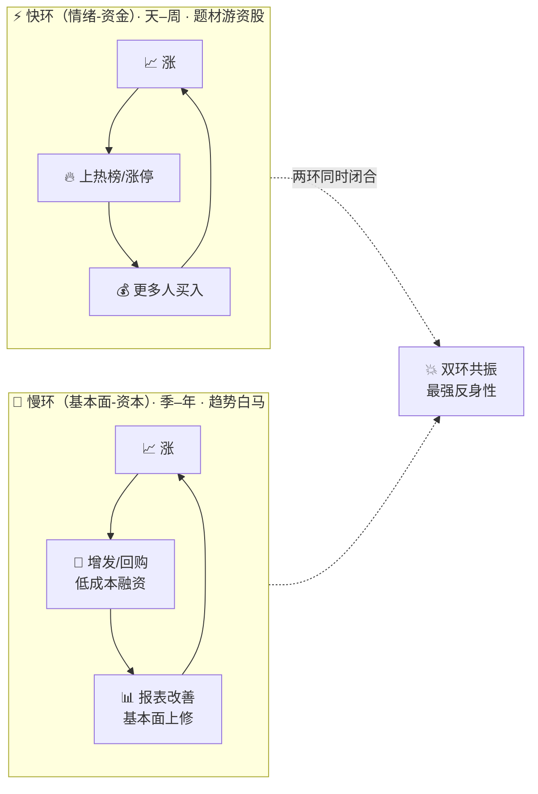
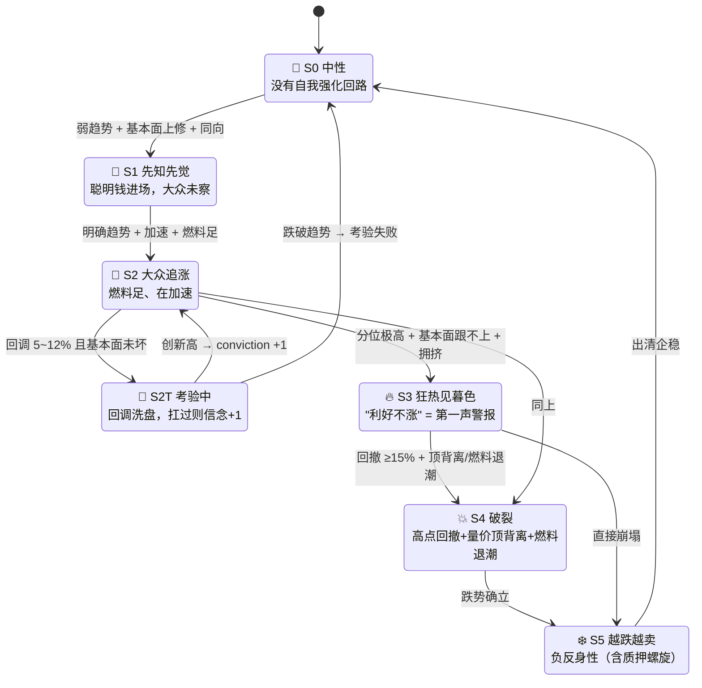

# 🔄 索罗斯反身性识别器

**简体中文** | [English](README.en.md)

> **反身性 = 涨会让它更涨、跌会让它更跌的自我强化循环。**
> 本工具量化"价格自己制造行情"的**强度与阶段**，回答"能不能顺势 / 转到哪一圈 / 何时该走"
> ——**不预测顶底，不构成投资建议。**

> 项目状态：QUANTSKILLS **社区项目（Community Project）**，未经官方审核 / 认证 / 背书。任务编号 `#48`。

<p align="center">
  
  
  
  
  
  
  
  
</p>

---

## 📖 这是什么

真实市场里有效市场假说基本失真、追涨杀跌才是常态。索罗斯的**反身性理论**说的就是这件事：
参与者的认知改变价格，价格又反过来改变认知，形成自我强化回路。

本 skill 把这个回路**量化**出来，回答交易上三个要命的问题：

1. 这波涨 / 跌是不是**自我强化**的（能不能顺势）？
2. 循环转到**哪一圈**了（决定仓位纪律）？
3. **燃料**（新钱）还在进吗、**油箱裂缝**（质押 / 解禁 / 大宗）在漏吗？

**明确不做**：不预测顶底、不判断"价值"、不假设市场有效。

---

## 🔁 双环模型



`loop_type ∈ {fast, slow, dual, none}` 决定用哪套窗口参数——**快环按天量、慢环按季量**，同一状态机换尺子。

| 环 | 回路（人话） | 周期 | 主战场 | 判定读数 |
|---|---|---|---|---|
| **快环**（情绪-资金） | 涨→上热榜→更多人买→再涨 | 天–周 | 题材股、游资股（**可无基本面**） | `FastLoop`（价格 × 关注度 × 资金 共振） |
| **慢环**（基本面-资本） | 涨→增发/回购改善报表→基本面上修→再涨 | 季–年 | 趋势白马、产业主升浪 | `CogF × ParF`（双函数活跃） |
| **双环共振** | 快慢同时闭合 | — | 最强反身性 | 两者皆高 |

---

## 🎬 阶段状态机（六阶段 + 考验，连续确认防抖）



| 阶段 | 人话 | 建议仓位 |
|---|---|---|
| `S0` 中性 | 没有自我强化回路 | `observe` |
| `S1` 萌芽 | 先知先觉资金进场，趋势未被大众认知 | `observe` |
| `S2` 加速 | 大众追涨、燃料足、在加速（含**考验**：扛过洗盘 conviction+1） | **`add`** |
| `S3` 狂热→暮色 | 分位极高、基本面跟不上；**"利好不涨"（CogF 衰减）= 暮色第一信号** | **`reduce`** |
| `S4` 破裂 | 自高点回撤 ≥15% + **量价顶背离** / 燃料退潮 → 回路断了 | `exit` |
| `S5` 负反身性 | 越跌越卖（含质押螺旋：跌→强平→再跌） | `avoid` |

> **破裂只从回路里掉出来**：从未进入 S1/S2/S3 的票即便深度回撤，也只是普通下跌，不会冒认 S4。
> 量价顶背离的口径是"**价创新高而量不跟**"——抬轿子的人在撤。

---

## 🧮 核心读数

| 读数 | 学术说法 | 人话 |
|---|---|---|
| `P` | 价格趋势强度（斜率 ÷ 波动） | 涨得有多陡、多稳 |
| `Sync` | 价格趋势与基本面修正的同向性 | 回路闭没闭合 |
| `GAP` | 价格分位 − 基本面分位 | 股价跑在基本面前面多远（透支多少） |
| `CogF` | 认知函数活跃度 | 市场对利好的兴奋度；**"利好不涨"= 兴奋耗尽** |
| `ParF` | 参与函数活跃度 | 股价是否在"创造"基本面（高位增发圈钱、回购做厚 EPS） |
| `FB_long` | 正反馈燃料分 | 还有多少新钱在进场（融资/游资/换手/回购增持） |
| `FB_neg` | 负反馈脆弱度 | 油箱裂缝：高质押、大额解禁、大宗折价出货 |
| `VolDiv` | 量价顶背离强度 | 股价还在往上顶，但买的人明显少了——虚 |
| `conviction` | 信念计数 | 扛过几次洗盘；**越扛越信，越信越危险** |

每个输出都配 `plain_text` 人话研判，可直接引用给用户。

---

## 🚀 快速开始

```bash
pip install --upgrade panda_data pyarrow numpy
export PANDA_USERNAME=<手机号>; export PANDA_PASSWORD=<密码>   # 或 ~/.pandadata/pandadata.env

# 单票/多票诊断
python 开发产物/scripts/build.py --mode watchlist --symbols 300750.SZ 688256.SH --date 20260710 --save
# 全市场漏斗扫描
python 开发产物/scripts/build.py --mode scan --date 20260710 --top-n 300 --save
# 全离线自测（无 panda_data 也全绿）
python 开发产物/scripts/test.py
```

---

## 📂 目录

```
开发产物/
  scripts/
    reflexivity.py   核心逻辑（纯逻辑零 IO：双环双函数 + 六阶段状态机 + 破裂判定）
    datasource.py    PandaData → 标准面板 + 事件（PIT，16 个接口）
    build.py         run / validate_input / watchlist + scan / 生产 parquet
    render.py        个股档案 markdown + HTML（学术读数 + 通俗解读 + 六维雷达）
    test.py          全离线合成夹具（22 用例）
  references/
    api_guide.md         数据接口 + D1 真机实测结论
    quality_evidence.md  参数整定 + 测试覆盖 + 缺陷修复记录
  SKILL.md / skill.json
生产产物/
  database.parquet              结果面板（随包样例：20260710 / 2 票 + MARKET 汇总）
  sample_reflexivity.html       诊断看板样本（宁德 S0 / 寒武纪 S1）
  sample_reflexivity.md         markdown 档案样本
  sample_688981_dashboard.html  单票看板样本（中芯国际，六维雷达 + 阶段时序）
  SKILL.md                      生产结果读取规则
```

---

## 🔌 数据接口（16 个，PIT 严格）

| 类别 | 接口 |
|---|---|
| 价 | `get_stock_daily` · `get_factor` |
| 基本面 | `get_fina_reports` · `get_fina_forecast` · `get_fina_performance` |
| 资金 | `get_margin` · `get_lhb_list` · `get_hsgt_hold` · `get_holder_count` |
| 资本行为 | `get_stock_private_placement` · `get_repurchase` · `get_stock_shareholder_change` |
| 风险 | `get_stock_pledge` · `get_restricted_list` · `get_block_trade` · `get_stock_status_change` |

---

## ⚖️ 数据与免责

- **数据源**：PandaData（凭证走环境变量或 `~/.pandadata/pandadata.env`，**绝不硬编码**）。
- **已知限制**：北向个股数据 2024/08 后多停披露 → 该成分**默认零权重**；快报覆盖不全 → 基本面链以预告 + 财报为主；
  历史不足 `min_history=80` 交易日时保守置 S0。
- **参数**：核心阈值集中在 `DEFAULT_CONFIG`（破裂回撤 15%、狂热分位 90、质押警戒 55% 等），整定过程见 `quality_evidence.md`。

> **Community Project，未经 QuantSkills 官方审核 / 认证 / 背书。仅量化研究与教育示例，不构成投资建议，
> 不承诺收益，不预测顶底。** 反身性阶段与仓位建议为**纪律参考、非交易指令**。

License: **GPL-3.0-only**
